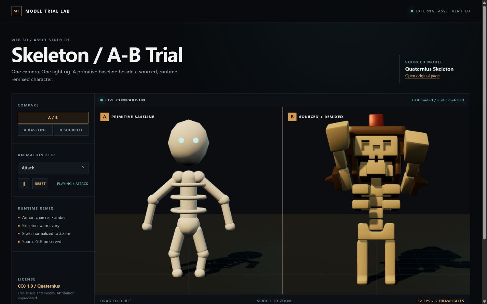

# Source Game Models

[English](README.md) | **简体中文**

`source-game-models` 是一个 Codex skill，用于为 Web 3D 游戏搜索、核验授权、改造并接入免费的第三方 3D 模型。



预览图在相同镜头和光照下，对比了基础几何体拼装角色与搜索后进行运行时改造的模型。外部模型为 [Quaternius 制作的 Skeleton](https://poly.pizza/m/DM4QScSmbS)，采用 [CC0 1.0](https://creativecommons.org/publicdomain/zero/1.0/) 授权。

## 安装

让 Codex 从本仓库安装这个 skill：

```text
请从以下 GitHub 地址安装 source-game-models skill：
https://github.com/liijiann/source-game-models/tree/main/source-game-models
```

skill 会安装到 `~/.codex/skills/source-game-models`，并从下一轮任务开始可用。

## 使用

显式调用可以获得最稳定的触发效果：

```text
使用 $source-game-models，为我的 Three.js 游戏寻找一个可免费商用的动画角色。下载前先展示授权明确的候选。
```

当任务涉及为 Three.js、React Three Fiber 或 Babylon.js 项目寻找或改进角色、道具、载具、建筑、环境或动画资产时，它也可以自动触发。

## 它强制执行的流程

- 搜索前分析项目的美术方向和性能预算。
- 提供可核验的候选，列明作者、来源、许可证、格式、动画和性能信息。
- 获得用户确认后才下载。
- 拒绝授权不明、盗提、仅限非商业用途或禁止衍生修改的资产。
- 审计 glTF/GLB 文件，并在 `THIRD_PARTY_ASSETS.md` 中记录出处。
- 优先改造材质、比例、部件和动画，再考虑使用 Blender 修改网格。
- 在真实游戏场景中验证效果，包括移动端性能。

这个 skill 默认只选择免费且具有明确资产授权的模型，下载前必须由用户确认，并执行 glTF/GLB 审计、运行时优先改造和浏览器验收。它不会把来源不明或盗提的模型当作可接受的最终美术资产。
